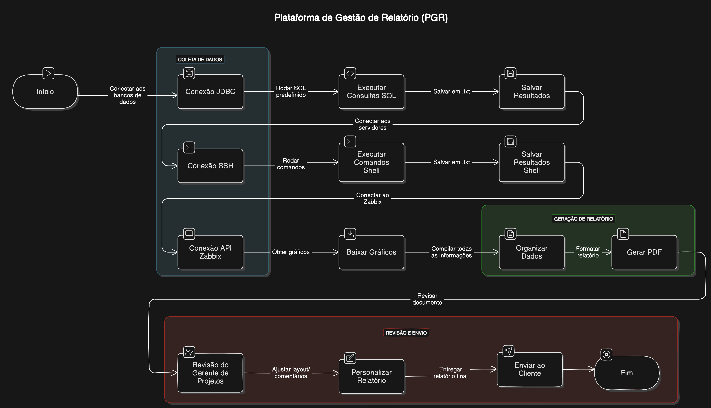

# Plataforma de Gestão de Relatório (PGR)

## 📚 Descrição do Projeto
A **Plataforma de Gestão de Relatório (PGR)** é um sistema desenvolvido para automatizar a geração de relatórios situacionais a partir de dados coletados diretamente dos bancos de dados, servidores e gráficos gerados pelo Zabbix. Ele visa otimizar o processo de coleta, organização e apresentação de informações para os clientes.

---

## ⚙️ Funcionalidades
- **Automatização da Geração de Relatórios**: A plataforma coleta dados situacionais de diferentes fontes e os organiza em relatórios formatados.
- **Conexão Segura**: Utiliza conexões seguras via SSH e HTTPS para coletar dados.
- **Download de Gráficos**: Integra-se ao Zabbix para obter gráficos e anexá-los aos relatórios.

---

## 🛠️ Como Funciona
A PGR realiza a coleta de dados a partir de três fontes principais e organiza essas informações em relatórios PDF prontos para serem revisados e enviados aos clientes.

### 1. Coleta de Dados
A coleta de dados é feita a partir de três métodos diferentes:

#### 📂 1.1 Coleta de Dados de Bancos de Dados
- Conexão via **JDBC (Java Database Connector)**.
- O sistema lê um arquivo SQL predefinido, executa as consultas no banco de dados e retorna as informações em um arquivo `.txt`.

#### 🖥️ 1.2 Execução de Comandos no Sistema Operacional
- Conexão via **SSH** em servidores remotos.
- O sistema executa comandos **Shell** e retorna as respostas em um arquivo `.txt`.

#### 📊 1.3 Requisições ao Zabbix
- Utilização do **pyZabbix** para interagir com a API do Zabbix.
- Download de gráficos gerados pelo Zabbix através de requisições **HTTPS**.

---

## 📄 Apresentação dos Dados
Após a coleta de dados, o sistema reorganiza as informações em um arquivo **PDF** com a formatação necessária. Esse arquivo PDF fica disponível para que o **Gerente de Projetos** possa revisá-lo e personalizá-lo da maneira que preferir. Após essa personalização, o Gerente de Projetos é responsável por encaminhar o relatório final aos clientes.

---

## 🚀 Tecnologias Utilizadas
- **Java** para conexão com bancos de dados.
- **SSH** para comunicação segura com servidores.
- **Shell** para execução de comandos no sistema operacional.
- **pyZabbix** para integração com o Zabbix.
- **PDF Generation** para formatação final dos relatórios.

---

## 📧 Contato
Para mais informações, entre em contato com o time responsável pelo desenvolvimento da PGR.
- davi.capistrano@tauge.com.br